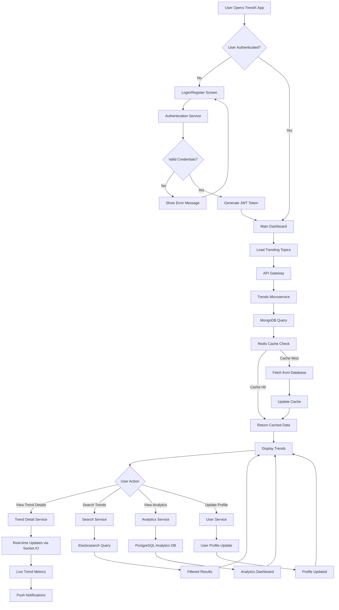
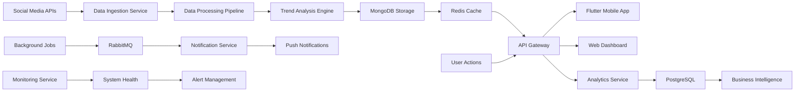
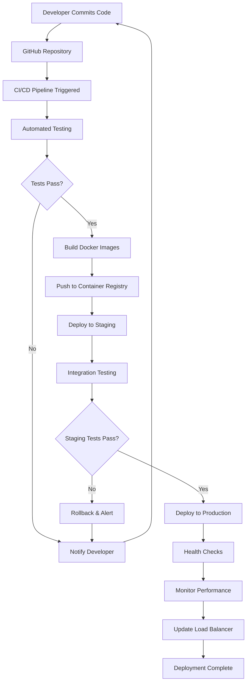

# TrendX System Architecture & Design

## System Workflow Diagram



## Data Flow Architecture Diagram

```mermaid
sequenceDiagram
    participant U as User
    participant F as Flutter App
    participant AG as API Gateway
    participant TS as Trends Service
    participant AS as Analytics Service
    participant M as MongoDB
    parameter R as Redis
    participant P as PostgreSQL
    participant SM as Social Media APIs
    
    U->>F: Open App
    F->>AG: Request Authentication
    AG->>F: Return JWT Token
    
    F->>AG: Request Trending Topics
    AG->>TS: Forward Request
    TS->>R: Check Cache
    alt Cache Hit
        R->>TS: Return Cached Data
    else Cache Miss
        TS->>M: Query Database
        M->>TS: Return Trend Data
        TS->>R: Update Cache
    end
    TS->>AG: Return Trends
    AG->>F: Send Response
    F->>U: Display Trends
    
    U->>F: View Analytics
    F->>AG: Request Analytics Data
    AG->>AS: Forward Request
    AS->>P: Query Analytics DB
    P->>AS: Return Metrics
    AS->>AG: Send Analytics
    AG->>F: Return Data
    F->>U: Show Analytics Dashboard
    
    Note over SM: Background Process
    SM->>TS: Social Media Data
    TS->>M: Store Trend Updates
    TS->>R: Invalidate Cache
```

## 1. Technical Architecture Overview

TrendX operates on a sophisticated microservices architecture that prioritizes scalability, maintainability, and real-time performance. The system architecture is built around clear separation of concerns, with distinct layers handling presentation, business logic, and data management. At its core, the architecture consists of a client layer powered by Flutter applications for both mobile and web platforms, providing users with a seamless cross-platform experience. The API Gateway serves as the central entry point, intelligently routing requests to appropriate microservices while handling authentication, rate limiting, and request validation.

The microservices layer forms the backbone of the system, with independent services dedicated to specific business domains such as user management, trend analysis, analytics processing, and social media integration. This approach allows for independent scaling, deployment, and maintenance of different system components. The data layer employs a polyglot persistence strategy, utilizing MongoDB as the primary application database for flexible document storage, Redis for high-performance caching and session management, and PostgreSQL for complex analytical queries and reporting.

The technology stack leverages modern, proven technologies including Flutter with Dart for cross-platform frontend development, Node.js with TypeScript for scalable backend services, and RabbitMQ for reliable asynchronous message processing. The entire system is deployed on AWS cloud infrastructure using containerized deployment with Docker and Kubernetes orchestration, ensuring high availability, automatic scaling, and efficient resource utilization. Real-time capabilities are powered by Socket.IO, enabling live updates and instant notifications to keep users engaged with the latest trending content.

External integrations play a crucial role in the system's functionality, connecting with various social media APIs including Twitter, Instagram, TikTok, and Facebook to gather real-time trend data. These integrations are managed through dedicated services that handle API rate limits, data transformation, and error recovery, ensuring reliable data flow from external sources into the TrendX ecosystem.

## 2. Database Design

### 2.1 Database Strategy
TrendX employs a polyglot persistence approach, using different databases optimized for specific data types and access patterns.

### 2.2 MongoDB - Primary Application Database

**Users Collection:**
```javascript
{
  _id: ObjectId,
  username: String,
  email: String,
  passwordHash: String,
  profile: {
    displayName: String,
    avatar: String,
    bio: String,
    preferences: {
      categories: [String],
      notifications: Boolean
    }
  },
  createdAt: Date,
  lastActive: Date
}
```

**Trends Collection:**
```javascript
{
  _id: ObjectId,
  title: String,
  description: String,
  category: String,
  tags: [String],
  metrics: {
    engagementScore: Number,
    viralityIndex: Number,
    sentimentScore: Number,
    reachEstimate: Number
  },
  socialPlatforms: {
    twitter: { mentions: Number, hashtags: [String] },
    instagram: { posts: Number, engagement: Number },
    tiktok: { videos: Number, views: Number }
  },
  geolocation: {
    country: String,
    region: String,
    coordinates: [Number]
  },
  createdAt: Date,
  updatedAt: Date,
  isActive: Boolean
}
```

**Analytics Collection:**
```javascript
{
  _id: ObjectId,
  trendId: ObjectId,
  timestamp: Date,
  metrics: {
    views: Number,
    shares: Number,
    comments: Number,
    likes: Number
  },
  demographics: {
    ageGroups: Map,
    genderDistribution: Map,
    locationData: Map
  }
}
```

### 2.3 Redis - Caching Layer
- Session management and user authentication tokens
- Frequently accessed trend data for quick retrieval
- Real-time leaderboards and trending topics cache
- API rate limiting and request throttling data

### 2.4 PostgreSQL - Analytics Database
Structured data for complex analytical queries, reporting, and business intelligence with optimized indexing for time-series data analysis.

## 3. API Structure

### 3.1 RESTful API Design
TrendX API follows REST principles with clear resource-based URLs and standard HTTP methods.

**Base URL Structure:**
```
https://api.trendx.com/v1/
```

### 3.2 Core API Endpoints

**Authentication Endpoints:**
```
POST /auth/register          - User registration
POST /auth/login            - User authentication
POST /auth/refresh          - Token refresh
DELETE /auth/logout         - User logout
```

**Trends Management:**
```
GET /trends                 - Retrieve trending topics
GET /trends/{id}           - Get specific trend details
POST /trends               - Create new trend (admin)
PUT /trends/{id}           - Update trend information
DELETE /trends/{id}        - Remove trend
GET /trends/search         - Search trends with filters
```

**User Management:**
```
GET /users/profile         - Get user profile
PUT /users/profile         - Update user profile
GET /users/preferences     - Get user preferences
PUT /users/preferences     - Update preferences
GET /users/history         - User activity history
```

**Analytics Endpoints:**
```
GET /analytics/trends/{id}     - Trend performance metrics
GET /analytics/dashboard       - Dashboard summary data
GET /analytics/reports         - Generate custom reports
GET /analytics/realtime        - Real-time statistics
```

### 3.3 API Response Format
```javascript
{
  "success": boolean,
  "data": object | array,
  "message": string,
  "timestamp": string,
  "pagination": {
    "page": number,
    "limit": number,
    "total": number,
    "hasNext": boolean
  }
}
```

### 3.4 Error Handling
Standardized error responses with appropriate HTTP status codes and detailed error messages for debugging and user feedback.

## 4. Frontend Architecture

### 4.1 Flutter Application Structure
The Flutter application follows a clean architecture pattern with clear separation of concerns and dependency injection.

**Project Structure:**
```
lib/
├── core/
│   ├── constants/
│   ├── errors/
│   ├── network/
│   └── utils/
├── features/
│   ├── authentication/
│   │   ├── data/
│   │   ├── domain/
│   │   └── presentation/
│   ├── trends/
│   │   ├── data/
│   │   ├── domain/
│   │   └── presentation/
│   └── analytics/
├── shared/
│   ├── widgets/
│   ├── themes/
│   └── services/
└── main.dart
```

### 4.2 State Management
**Provider Pattern Implementation:**
- Centralized state management using Provider package
- Separate providers for different feature domains
- Reactive UI updates based on state changes

**Key Providers:**
```dart
class AuthProvider extends ChangeNotifier {
  User? _currentUser;
  AuthenticationStatus _status = AuthenticationStatus.unknown;
  
  // Authentication methods and state management
}

class TrendsProvider extends ChangeNotifier {
  List<Trend> _trends = [];
  TrendFilter _currentFilter = TrendFilter.all();
  
  // Trends data management and filtering
}
```

### 4.3 Navigation Architecture
**Hierarchical Navigation:**
- Bottom navigation for main app sections
- Stack-based navigation within each section
- Deep linking support for direct content access

**Route Structure:**
```dart
class AppRouter {
  static const String splash = '/';
  static const String login = '/login';
  static const String home = '/home';
  static const String trends = '/trends';
  static const String trendDetail = '/trends/:id';
  static const String profile = '/profile';
  static const String analytics = '/analytics';
}
```

### 4.4 UI/UX Design Patterns

**Material Design 3 Implementation:**
- Consistent color schemes and typography
- Adaptive layouts for different screen sizes
- Accessibility compliance with screen readers
- Dark/light theme support

**Custom Widgets:**
```dart
class TrendCard extends StatelessWidget {
  final Trend trend;
  final VoidCallback? onTap;
  
  // Reusable trend display component
}

class AnalyticsChart extends StatefulWidget {
  final List<DataPoint> data;
  final ChartType type;
  
  // Interactive data visualization widget
}
```

### 4.5 Performance Optimization

**Lazy Loading:**
- Paginated data loading for large datasets
- Image caching and optimization
- Background data synchronization

**Memory Management:**
- Proper disposal of controllers and streams
- Efficient list rendering with ListView.builder
- Image memory optimization with cached_network_image

### 4.6 Offline Capability
- Local SQLite database for offline data storage
- Sync mechanism for data consistency
- Offline-first approach for core features
- Background sync when connectivity is restored

## 5. Security Architecture

### 5.1 Authentication & Authorization
- JWT-based authentication with refresh tokens
- Role-based access control (RBAC)
- OAuth integration for social media platforms
- Multi-factor authentication support

### 5.2 Data Protection
- End-to-end encryption for sensitive data
- HTTPS/TLS for all API communications
- Input validation and sanitization
- SQL injection and XSS protection

### 5.3 API Security
- Rate limiting to prevent abuse
- API key management for external services
- Request signing for critical operations
- CORS configuration for web clients

## 6. Scalability & Performance

### 6.1 Horizontal Scaling
- Microservices architecture for independent scaling
- Load balancing across multiple server instances
- Database sharding for large datasets
- CDN integration for static content delivery

### 6.2 Caching Strategy
- Multi-level caching (Redis, application-level, CDN)
- Cache invalidation strategies
- Real-time data synchronization
- Optimized database queries with indexing

### 6.3 Monitoring & Analytics
- Application performance monitoring (APM)
- Real-time error tracking and alerting
- User behavior analytics
- System health dashboards

## System Integration Workflow



## Deployment Workflow



This architecture ensures TrendX can handle high user loads, massive data volumes, and global scale while maintaining exceptional performance and reliability through intelligent design patterns, robust monitoring systems, and automated scaling capabilities.ser loads while maintaining excellent performance and user experience across all platforms.