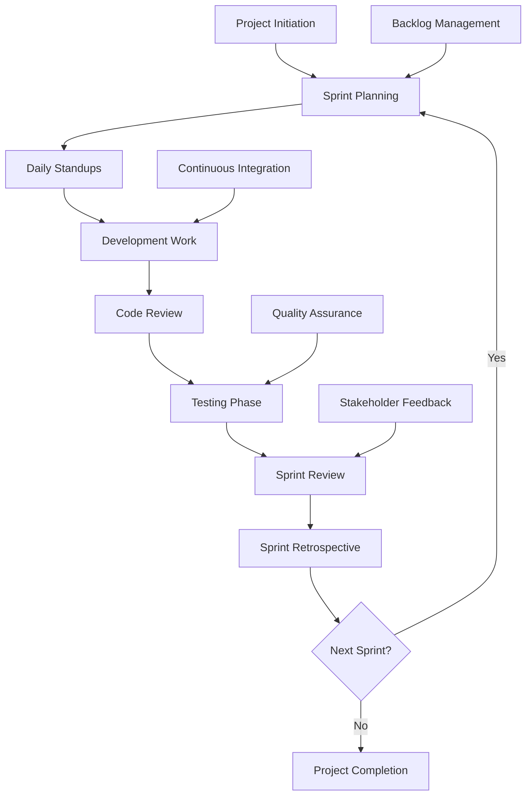
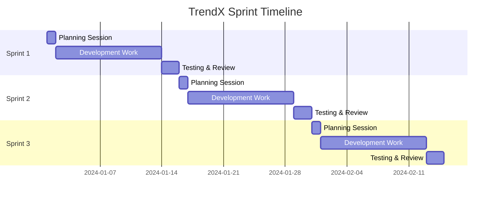
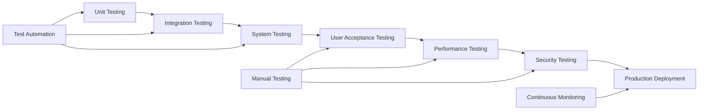
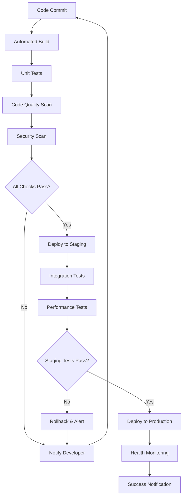

# TrendX Development Methodology & Workflow

## Development Methodology Framework



## Agile Development Approach & Implementation Strategy

TrendX adopts a comprehensive Agile development methodology that emphasizes iterative development, continuous collaboration, and adaptive planning to deliver high-quality software solutions. The Agile approach enables the team to respond effectively to changing requirements while maintaining focus on delivering value to end users through regular incremental releases. The methodology incorporates Scrum framework principles with customized practices tailored to the specific needs of social media trend analysis platform development.

The Agile implementation begins with thorough project planning that establishes clear objectives, defines user stories, and creates a comprehensive product backlog. The team conducts regular backlog grooming sessions to prioritize features based on business value, technical complexity, and user feedback. User stories are written from the perspective of different user personas including casual trend followers, content creators, business analysts, and system administrators, ensuring comprehensive coverage of all user needs and use cases.

The development team embraces Agile principles through collaborative decision-making, self-organization, and continuous improvement practices. Cross-functional team members work together to break down complex features into manageable tasks, estimate effort requirements, and identify potential risks or dependencies. The team maintains a sustainable development pace that balances productivity with quality, avoiding burnout while ensuring consistent progress toward project goals.

Stakeholder engagement plays a crucial role in the Agile process, with regular demonstrations and feedback sessions that ensure the product meets user expectations and business requirements. The team conducts user acceptance testing throughout the development cycle, incorporating feedback into subsequent iterations to refine features and improve user experience. This collaborative approach ensures that the final product aligns with stakeholder vision while addressing real-world user needs.

## Sprint Planning & Execution Methodology



Sprint planning forms the foundation of TrendX's development rhythm, with carefully structured two-week sprint cycles that balance ambitious goals with realistic deliverables. Each sprint begins with a comprehensive planning session where the team reviews the product backlog, selects user stories for the upcoming sprint, and breaks down selected features into specific development tasks. The planning process involves detailed estimation using story points and planning poker techniques to ensure accurate effort assessment and realistic sprint commitments.

The sprint planning session includes thorough analysis of user story acceptance criteria, identification of technical dependencies, and discussion of potential implementation approaches. Team members collaborate to identify risks, clarify requirements, and establish clear definitions of done for each user story. The planning process also includes capacity planning that considers team member availability, holidays, and other commitments to ensure sprint goals remain achievable.

Sprint execution follows a structured daily rhythm with morning standup meetings that provide visibility into progress, identify blockers, and facilitate team coordination. Each team member shares updates on completed work, planned activities for the day, and any impediments requiring assistance or resolution. The standup meetings maintain focus through time-boxing and structured format while encouraging open communication and collaborative problem-solving.

Throughout the sprint, the team maintains focus on sprint goals while remaining flexible to address emerging issues or changing priorities. Work-in-progress limits help maintain quality and prevent context switching that could impact productivity. The team uses visual management tools including Kanban boards and burndown charts to track progress and identify potential issues early in the sprint cycle.

Sprint reviews provide opportunities for stakeholder feedback and product demonstration, ensuring that completed features meet user expectations and business requirements. The team demonstrates working software to stakeholders, gathers feedback on implemented features, and discusses upcoming priorities based on user needs and market conditions. Sprint retrospectives focus on continuous improvement, identifying successful practices to continue and areas for enhancement in future sprints.

## Version Control Workflow & Code Management

```mermaid
gitgraph
    commit id: "Initial Setup"
    branch develop
    checkout develop
    commit id: "Feature Planning"
    branch feature/user-auth
    checkout feature/user-auth
    commit id: "Auth Implementation"
    commit id: "Auth Testing"
    checkout develop
    merge feature/user-auth
    branch feature/trend-analysis
    checkout feature/trend-analysis
    commit id: "Analysis Engine"
    commit id: "Data Processing"
    checkout develop
    merge feature/trend-analysis
    checkout main
    merge develop
    commit id: "Release v1.0"
```

TrendX implements a sophisticated Git-based version control workflow that ensures code quality, facilitates collaboration, and maintains stable release branches. The workflow follows GitFlow methodology with adaptations for the team's specific needs and project requirements. The main branch maintains production-ready code with strict quality gates, while the develop branch serves as the integration point for feature development and testing.

Feature development occurs in dedicated feature branches created from the develop branch, allowing developers to work independently on specific functionality without interfering with other team members' work. Feature branch naming conventions follow a structured format that includes the feature type, brief description, and associated ticket number for easy identification and tracking. Each feature branch focuses on a single user story or related set of tasks to maintain clear scope and facilitate code review processes.

The code review process requires peer review for all changes before merging into shared branches, ensuring code quality and knowledge sharing across the team. Pull requests include detailed descriptions of changes, testing instructions, and links to relevant documentation or design specifications. Reviewers examine code for functionality, performance, security considerations, and adherence to coding standards established by the team.

Automated checks run on all pull requests, including unit tests, integration tests, code quality analysis, and security scans. These automated gates prevent low-quality code from entering shared branches while providing immediate feedback to developers about potential issues. The continuous integration system builds and tests all changes automatically, ensuring that new code integrates properly with existing functionality.

Branch protection rules enforce the review process and prevent direct commits to critical branches, maintaining code quality and audit trails for all changes. The workflow includes automated deployment pipelines that deploy approved changes to staging environments for additional testing before production release. Release branches provide stable environments for final testing and bug fixes without blocking ongoing feature development.

## Testing Strategies & Quality Assurance Framework



TrendX employs a comprehensive testing strategy that encompasses multiple testing levels and methodologies to ensure software quality, reliability, and performance. The testing pyramid approach emphasizes automated unit testing as the foundation, with integration testing, system testing, and user acceptance testing forming successive layers of quality assurance. This multi-layered approach catches defects early in the development cycle while ensuring comprehensive coverage of all system functionality.

Unit testing forms the cornerstone of the testing strategy, with developers writing comprehensive test suites for individual functions, classes, and components. The team maintains high code coverage standards with automated coverage reporting that identifies untested code paths and ensures thorough validation of business logic. Unit tests run automatically as part of the continuous integration pipeline, providing immediate feedback on code changes and preventing regression issues.

Integration testing validates the interaction between different system components, including API endpoints, database operations, and external service integrations. Automated integration tests verify data flow between microservices, validate API contracts, and ensure proper error handling across service boundaries. The testing framework includes mock services and test databases that provide consistent testing environments without dependencies on external systems.

System testing evaluates the complete application functionality through end-to-end test scenarios that simulate real user workflows. Automated browser testing validates user interface functionality across different devices and browsers, while API testing ensures backend services perform correctly under various conditions. The testing suite includes performance benchmarks that validate response times and system behavior under expected load conditions.

User acceptance testing involves stakeholders and end users in validating that implemented features meet business requirements and user expectations. The team conducts regular UAT sessions with structured test scenarios and feedback collection processes. User feedback drives iterative improvements and helps identify usability issues that might not be apparent through automated testing alone.

Performance testing ensures the system meets scalability and response time requirements under various load conditions. Load testing simulates expected user volumes while stress testing identifies system breaking points and resource limitations. The performance testing strategy includes database performance analysis, API response time validation, and frontend rendering performance evaluation across different devices and network conditions.

Security testing validates the system's resistance to common vulnerabilities and attack vectors through automated security scans, penetration testing, and code analysis. The security testing framework includes authentication and authorization validation, input sanitization verification, and data encryption validation. Regular security assessments ensure ongoing protection against emerging threats and compliance with security best practices.

## Continuous Integration & Deployment Pipeline



The continuous integration and deployment pipeline automates the software delivery process from code commit to production deployment, ensuring consistent quality and reducing manual errors. The pipeline integrates with the version control system to trigger automated builds and tests whenever code changes are committed to shared branches. This automation provides immediate feedback to developers and maintains high code quality standards throughout the development process.

The CI/CD pipeline includes multiple stages of validation including automated testing, code quality analysis, security scanning, and deployment verification. Each stage must pass successfully before proceeding to the next step, creating quality gates that prevent defective code from reaching production environments. The pipeline configuration supports parallel execution of independent tasks to minimize build times while maintaining thorough validation coverage.

Deployment automation ensures consistent and reliable software releases across different environments including development, staging, and production. The deployment process includes database migrations, configuration updates, and service health checks that verify successful deployment completion. Rollback mechanisms provide quick recovery options in case of deployment issues or unexpected problems in production environments.

Monitoring and alerting systems provide visibility into pipeline execution and deployment status, notifying team members of build failures, test results, and deployment completion. The monitoring framework tracks key metrics including build success rates, test coverage, deployment frequency, and system performance indicators that help identify trends and improvement opportunities.

This comprehensive development methodology and workflow framework ensures TrendX delivers high-quality software through structured processes, automated quality gates, and continuous improvement practices that support both individual productivity and team collaboration effectiveness.